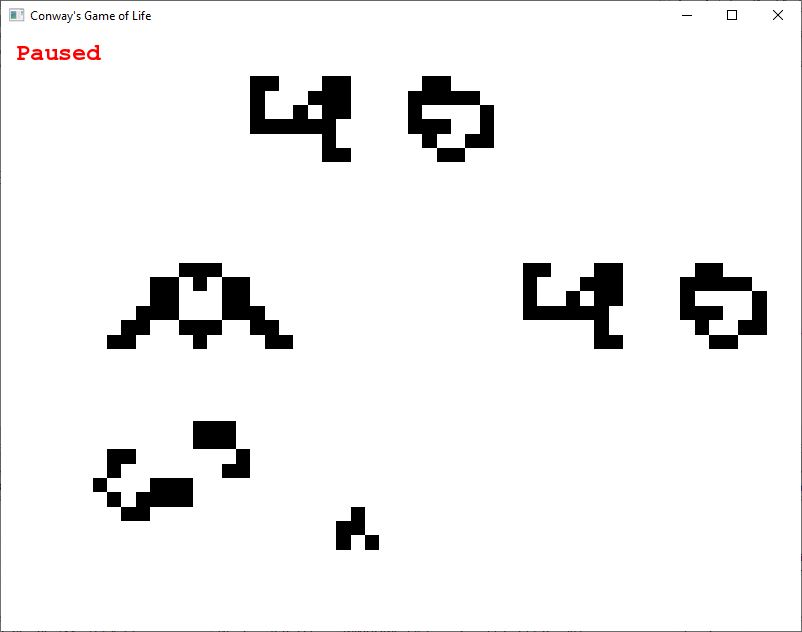

# Game of Life

A simple Conway's Game of Life app made in C++ and SFML.

## Controls 

- G: activate/deactivate grid
- Q: decrease epochs/s
- W: increase epochs/s
- Arrows: move around grid
- Z: zoom in
- X: zoom out
- Mouse click: activate/deactivate cell
- Mouse wheel: smooth zoom

## Dependencies

- SFML
- OpenMP support
- C++11

## Screenshot

